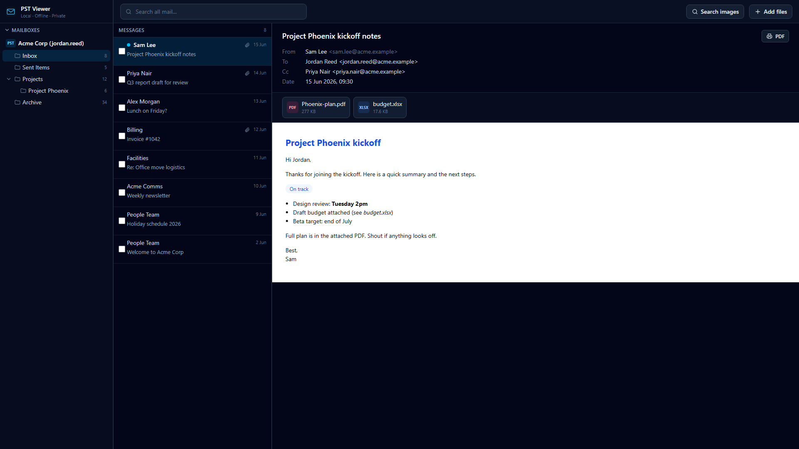
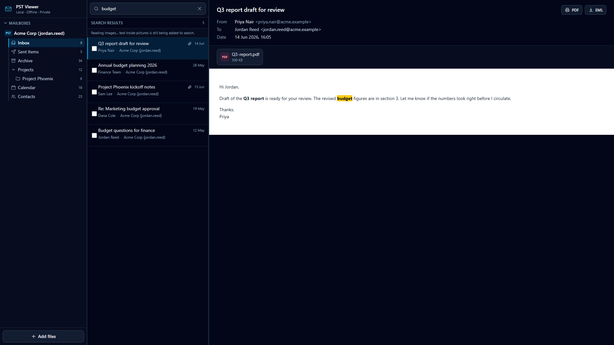
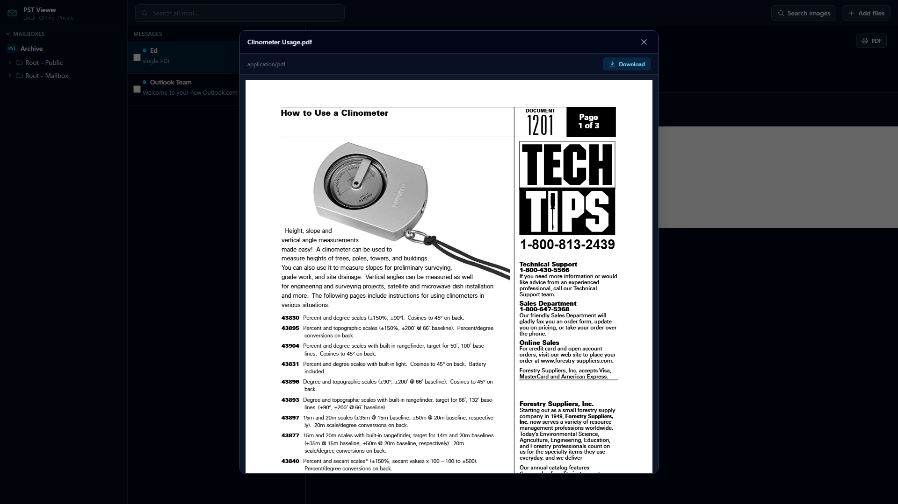
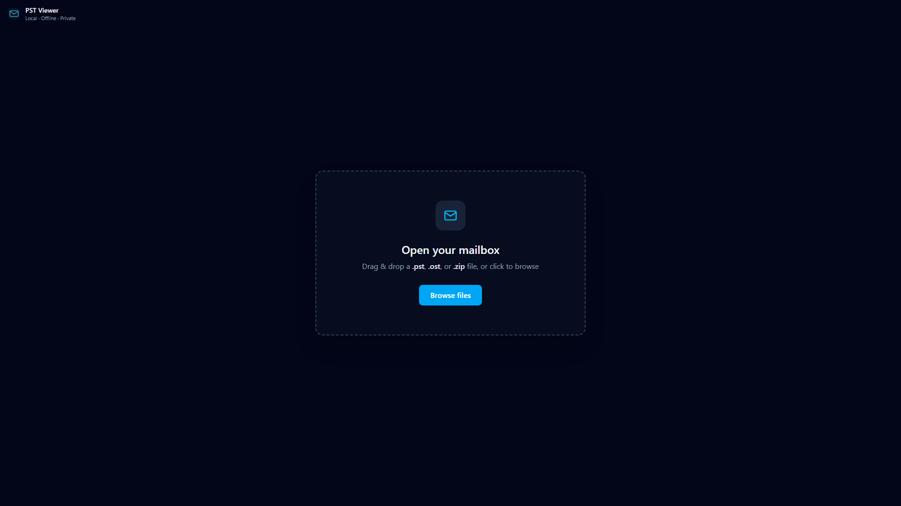

# PST Viewer

A fast, private, **fully in-browser** viewer for Outlook **`.pst` / `.ost`** mailboxes (and `.zip` archives containing them). Everything runs locally on your device: no server, no Python, no build tools to install for end users, and **nothing is ever uploaded**.

Installable as an offline app (PWA): load the site once and it keeps working with no internet.

## Use it now

**Live app: https://bod09.github.io/pst-viewer/**

No setup needed. Open the link, drop in a `.pst`, `.ost`, or `.zip`, and start reading. Nothing is uploaded; everything runs in your browser (see [Privacy](#privacy)). If you would rather run or host it yourself, see [Run it](#run-it) and [Deploy](#deploy).

## Screenshots

| | |
| --- | --- |
|  |  |
|  |  |

*(Sample data shown is fictional.)*

## Features

- **Open** `.pst`, `.ost`, and `.zip` files (zips are scanned automatically for mailboxes, including nested ones), by drag-and-drop or browse. Password-protected mailboxes open too: an Outlook PST password gates Outlook's own UI, not the data, so none is needed to read the mailbox here.
- **Multiple mailboxes** at once, with smart auto-labels and inline rename.
- **1:1 email viewing**: full HTML rendering (and RTF-encapsulated HTML) with inline images, in a sandboxed frame. Remote images load like a normal mail client, with invisible tracking pixels (1x1 / hidden images) stripped. **Click any image to view it full screen**, then zoom to actual size and drag to pan. A **Headers** button shows the message's full original transport headers. Colour categories, follow-up flags, importance, and sensitivity show as chips, and `winmail.dat` (TNEF) and S/MIME signed messages are unpacked to reveal their real body and attachments.
- **Attachment previews**: images, PDF, text/code, audio, video, nested emails, **spreadsheets** (`.xlsx/.xls/.csv/.ods`), and **Word** (`.docx`). Anything else is one-click downloadable.
- **Every Outlook item type**: contacts (name, emails, phones, company, addresses, birthday, notes), distribution lists (with members), calendar appointments (time, location, organizer, attendees), tasks (status, due date, % complete), journal entries, and sticky notes all render as cards, so nothing shows up blank.
- **Fast search** across all mailboxes: subjects, senders, recipients, body text, attachment names, and text inside images. Words are typo-tolerant (fuzzy); numbers and reference codes are matched **exactly**, so an ID search stays precise. Matches are highlighted in the open email (the text, and the matching picture) and it scrolls to the first hit.
- **OCR** (automatic): text inside images is read in the background and made searchable, covering both image attachments and pictures embedded in the email body. Images are sharpened first to read small text more reliably, and results are cached on your device for faster re-opens (cleared 7 days after a mailbox was last opened). Engine and model are bundled for full offline use.
- **Export**: save a single email as **PDF** or as its original **`.eml`** (preserving the real headers and attachments), or merge several emails into one PDF (oldest-first or newest-first).
- **Offline PWA**: works with no connection after first load, and is installable.

## Run it

Requires [Node.js](https://nodejs.org) (only for the dev/build step; the shipped app is plain static files).

```bash
npm install        # first time only
npm run dev        # development at http://localhost:5173
```

To build the production app and preview it (this is the real offline/installable version):

```bash
npm run build      # outputs static files to dist/
npm run preview    # serve the build at http://localhost:4173
```

## Deploy

The build is a static site, so you can host the contents of `dist/` on any static host (Netlify, Vercel, GitHub Pages, Cloudflare Pages, or any web server). No backend required. Once a visitor loads it, the service worker caches it for offline use. See [DEPLOY.md](DEPLOY.md) for a ready-made Caddy setup (`npm run deploy` assembles a drop-in `deploy/` folder).

## Privacy

There is no server. When you open a file, the browser reads it **directly from your disk** (in small slices, so even multi-gigabyte mailboxes work) and all parsing, rendering, search, OCR, and PDF export happen on your device. Your mailbox is never uploaded. Like a normal mail client, an email that references **remote images** will fetch those from the sender's servers when you view it (invisible tracking pixels are stripped, but a visible remote image can still tell the sender you opened it). Each remote image is fetched only once and then cached locally in your browser, so re-viewing it does not ping the sender again. Apart from that, the only network use is loading the app itself.

## Tech

React + Vite + TypeScript + Tailwind. PST parsing via [`@hiraokahypertools/pst-extractor`](https://www.npmjs.com/package/@hiraokahypertools/pst-extractor) in a Web Worker. Search via MiniSearch, PDF rendering via pdf.js, spreadsheets via SheetJS, Word via docx-preview, OCR via Tesseract.js, zip handling via fflate, HTML sanitizing via DOMPurify. PWA via vite-plugin-pwa (Workbox).

## Known limitations

- **PowerPoint (`.pptx`/`.ppt`)** and **OpenDocument text (`.odt`)** attachments are download-only (no reliable in-browser renderer).
- **Encrypted S/MIME** messages can't be read without the recipient's private key (signed S/MIME is decoded and shown).
- Corrupt mailboxes show a clear per-source error; other loaded mailboxes keep working.
- Search becomes available for a mailbox once its background indexing finishes (a progress indicator is shown).
- **Text inside images can be misread by OCR**, especially when it is very small or low-contrast. It also becomes searchable a little after the rest of a mailbox, since it is read in the background (a "Reading images" progress indicator shows while it runs).
- **Privacy browsers with canvas fingerprinting protection** (some hardened Chromium forks) scramble canvas pixel data, which breaks the image sharpening OCR relies on, so text inside images may not be searchable there. Body and text search still work everywhere. For image OCR, use a standard Chromium, or allow canvas/fingerprinting for the site.
